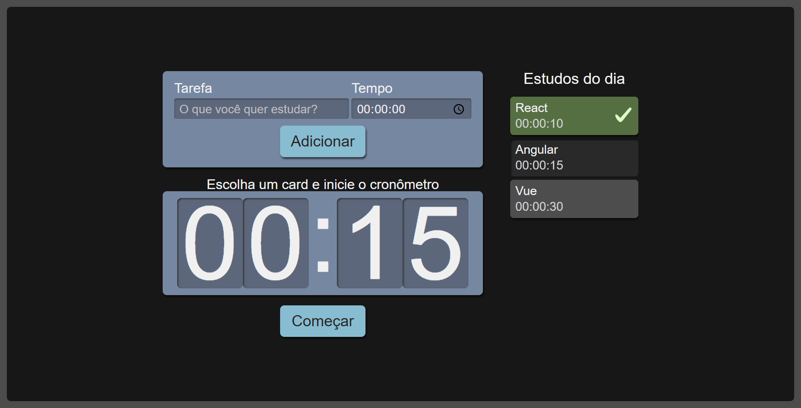

# Cronometro - Alura Studies



## Menu

- [Descrição](#descrição)
  - [Principais recursos incluem](#principais-recursos-incluem)
  - [Proximos passos de desenvolvimento](#proximos-passos-de-desenvolvimento)
- [Tecnologias Utilizadas](#tecnologias-utilizadas)
- [Estrutura de Pastas](#estrutura-de-pastas)
  - [Arquivos Principais](#arquivos-principais)
- [Como Instalar e Rodar o Projeto](#como-instalar-e-rodar-o-projeto)
  - [Configuração](#configuração)
  - [Casos de Uso Comuns](#casos-de-uso-comuns)
  - [Solução de Problemas](#solução-de-problemas)
- [Projeto ao Vivo](#projeto-ao-vivo)
- [Fluxo de Dados](#fluxo-de-dados)
- [Licença](#licença)
- [Autor](#autor)

## Descrição

Este projeto é uma aplicação React para gerenciar tarefas de estudo com um cronômetro integrado.

A aplicação permite aos usuários criar tarefas de estudo, definir o tempo necessário para cada uma, selecionar uma tarefa e iniciar um cronômetro regressivo. Quando o tempo acaba, a tarefa é marcada como concluída. A interface é amigável e responsiva, adaptando-se a diferentes tamanhos de tela.

Este projeto foi desenvolvido como parte do curso da Alura de React com TypeScript.

### Principais recursos incluem:

- Criação de tarefas de estudo com tempo definido
- Cronômetro regressivo para controle do tempo de estudo
- Marcação automática de tarefas concluídas
- Seleção visual de tarefas ativas
- Design responsivo para vários tamanhos de tela
- Interface intuitiva com cards de tarefas

### Proximos passos de desenvolvimento

- Implementar persistência de dados com localStorage ou backend
- Adicionar categorias para as tarefas de estudo
- Criar estatísticas de tempo estudado
- Implementar notificações sonoras ao finalizar o tempo
- Adicionar modo escuro/claro

## Tecnologias Utilizadas

- **React.JS:** Biblioteca JavaScript para a construção de interfaces de usuário
- **TypeScript:** Superset de JavaScript que adiciona tipagem estática
- **SCSS/SASS:** Pré-processador CSS para estilização avançada
- **CSS Modules:** Técnica para escopo local de estilos CSS
- **Vite:** Ferramenta de build rápida para desenvolvimento moderno
- **useState/useEffect:** Hooks do React para gerenciamento de estado e efeitos colaterais
- **uuid:** Biblioteca para geração de identificadores únicos
- **ESLint:** Ferramenta de análise de código para identificar problemas

## Estrutura de Pastas

```
alura-studies-timer/
├── public/
│   └── vite.svg
├── screenshot/
│   └── tela-principal.png
├── src/
│   ├── common/
│   │   └── utils/
│   │       └── datetime.ts
│   ├── components/
│   │   ├── Botao/
│   │   │   ├── index.tsx
│   │   │   └── Botao.module.scss
│   │   ├── Cronometro/
│   │   │   ├── index.tsx
│   │   │   ├── Cronometro.module.scss
│   │   │   └── Relogio/
│   │   │       ├── index.tsx
│   │   │       └── Relogio.module.scss
│   │   ├── Formulario/
│   │   │   ├── index.tsx
│   │   │   └── Formulario.module.scss
│   │   └── Lista/
│   │       ├── index.tsx
│   │       ├── Lista.module.scss
│   │       └── Item/
│   │           ├── index.tsx
│   │           └── Item.module.scss
│   ├── pages/
│   │   ├── App.tsx
│   │   └── App.module.scss
│   ├── types/
│   │   └── tarefa.ts
│   ├── index.css
│   └── main.tsx
├── .gitignore
├── eslint.config.js
├── index.html
├── package.json
├── README.md
├── tsconfig.json
├── tsconfig.app.json
├── tsconfig.node.json
└── vite.config.ts
```

### Arquivos Principais:

- `src/pages/App.tsx`: Componente principal da aplicação que gerencia o estado e a lógica de negócios
- `src/components/Formulario/index.tsx`: Componente para adicionar novas tarefas
- `src/components/Lista/index.tsx`: Componente que exibe a lista de tarefas
- `src/components/Cronometro/index.tsx`: Componente que gerencia o cronômetro
- `src/types/tarefa.ts`: Interface TypeScript que define a estrutura de dados das tarefas
- `src/common/utils/datetime.ts`: Utilitário para conversão de tempo
- `index.html`: Template HTML principal que serve como ponto de montagem para a aplicação React
- `vite.config.ts`: Configuração do Vite para build e desenvolvimento
- `tsconfig.json`: Configuração principal do TypeScript
- `package.json`: Configuração do projeto, scripts e dependências

## Como Instalar e Rodar o Projeto

Pré-requisitos:

- Node.js (versão 14.0 ou superior)
- npm (versão 6.0 ou superior)

1. Faça o clone deste repositório em sua máquina local:
   ```bash
   git clone https://github.com/seu-usuario/alura-studies-timer.git
   ```
2. Acesse o diretório do projeto:
   ```bash
   cd alura-studies-timer
   ```
3. Instale as dependências do projeto:
   ```bash
   npm install
   ```
4. Inicie o servidor de desenvolvimento:
   ```bash
   npm run dev
   ```
5. Acesse a aplicação em seu navegador no endereço que aparecer no terminal (geralmente http://localhost:5173)

### Configuração

A aplicação não requer configuração adicional para funcionar localmente. Todas as dependências necessárias são instaladas automaticamente com o comando `npm install`.

### Casos de Uso Comuns

1. Adicionando uma nova tarefa de estudo:
   - Digite o nome da tarefa no campo "Tarefa"
   - Defina o tempo necessário no campo "Tempo" (formato HH:MM:SS)
   - Clique em "Adicionar" para criar a tarefa

2. Iniciando o cronômetro:
   - Clique em uma tarefa na lista para selecioná-la
   - Clique no botão "Começar" no cronômetro
   - O tempo começará a contar regressivamente
   - Quando o tempo acabar, a tarefa será marcada como concluída

3. Visualizando tarefas concluídas:
   - As tarefas concluídas são marcadas com um ícone de verificação
   - Tarefas concluídas não podem ser selecionadas novamente

### Solução de Problemas

Problema Comum: Cronômetro não inicia

- Problema: O botão "Começar" não inicia a contagem regressiva.
- Solução:
  1. Verifique se você selecionou uma tarefa na lista.
  2. Certifique-se de que a tarefa selecionada tem um tempo válido.
  3. Verifique o console do navegador para mensagens de erro.

Problema Comum: Tarefas não aparecem na lista

- Problema: Após adicionar uma tarefa, ela não aparece na lista.
- Solução:
  1. Verifique se todos os campos do formulário foram preenchidos corretamente.
  2. Verifique o console do navegador para mensagens de erro.
  3. Reinicie a aplicação se o problema persistir.

## Projeto ao Vivo

Você pode ver o projeto ao vivo neste link: [https://alura-studies-timer.vercel.app/](https://alura-studies-timer.vercel.app/)

## Fluxo de Dados

A aplicação gerencia o fluxo de dados principalmente através do componente `App`, que serve como o contêiner principal de estado. Aqui está uma visão geral do fluxo de dados:

1. O estado inicial é definido em `App.tsx` para tarefas (`tarefas`) e tarefa selecionada (`selecionado`).
2. O componente `Formulario` permite ao usuário criar novas tarefas, que são adicionadas ao estado `tarefas`.
3. O componente `Lista` exibe as tarefas e permite a seleção de uma tarefa, atualizando o estado `selecionado`.
4. O componente `Cronometro` recebe a tarefa selecionada e inicia a contagem regressiva quando o usuário clica em "Começar".
5. Quando o cronômetro chega a zero, a função `finalizarTarefa` é chamada, marcando a tarefa como concluída.

```
     ┌─────────────────────────────────────────────┐
     │                   App                       │
     │  ┌─────────────────────────────────────┐    │
     │  │    Estado (tarefas, selecionado)    │    │
     │  └─────────────────────────────────────┘    │
     │         │                    ▲              │
     │         │ Props              │ Atualizações │
     │         │                    │ de Estado    │
     │         ▼                    │              │
     │  ┌─────────────────────────────────────┐    │
     │  │ Componentes (Formulario, Lista,     │    │
     │  │ Cronometro)                         │    │
     │  └─────────────────────────────────────┘    │
     └─────────────────────────────────────────────┘
```

## Licença

Este projeto está licenciado sob a Licença MIT. Veja o arquivo [LICENSE](https://github.com/Melksedeque/alura-studies-timer?tab=MIT-1-ov-file) para mais detalhes.

## Autor

- GitHub - [Melksedeque Silva](https://github.com/Melksedeque/)
- FrontEndMentor - [@Melksedeque](https://www.frontendmentor.io/profile/Melksedeque)
- Twitter / X - [@SouzaMelk](https://x.com/SouzaMelk)
- LinkedIn - [Melksedeque Silva](https://www.linkedin.com/in/melksedeque-silva/)
        